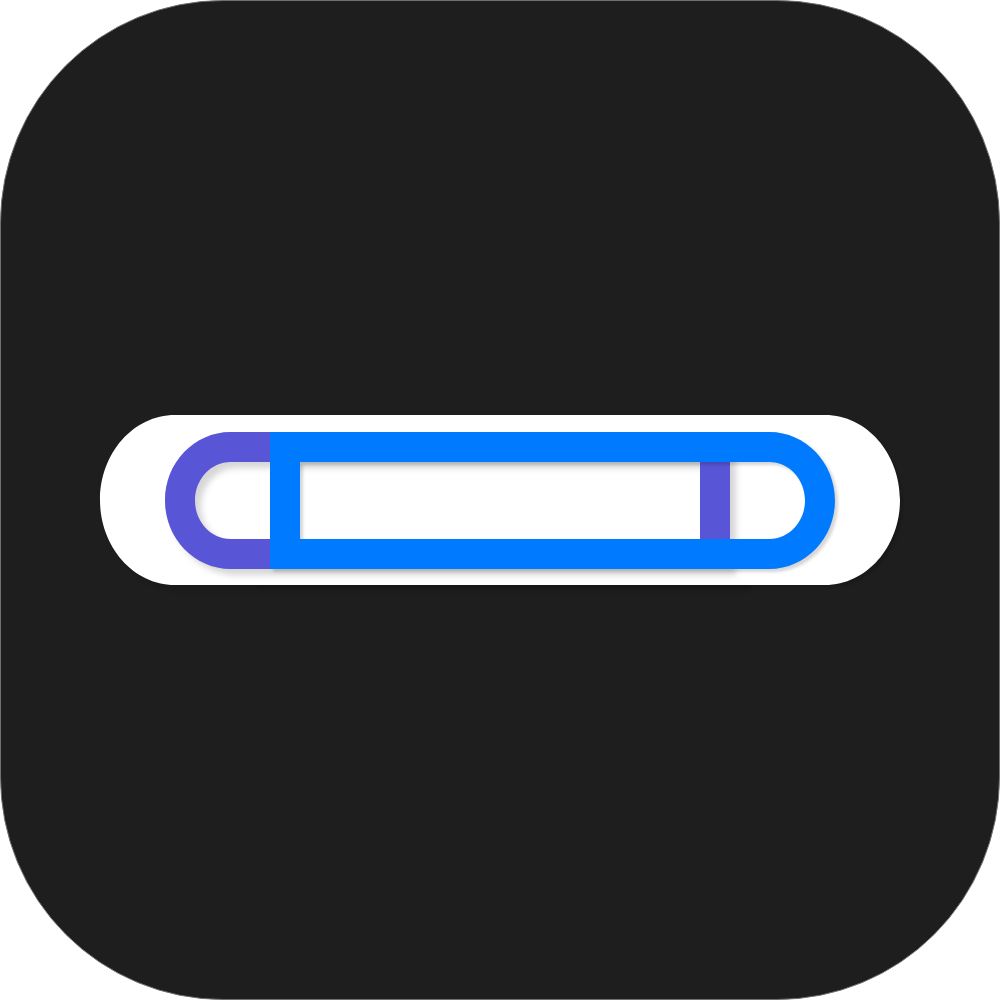
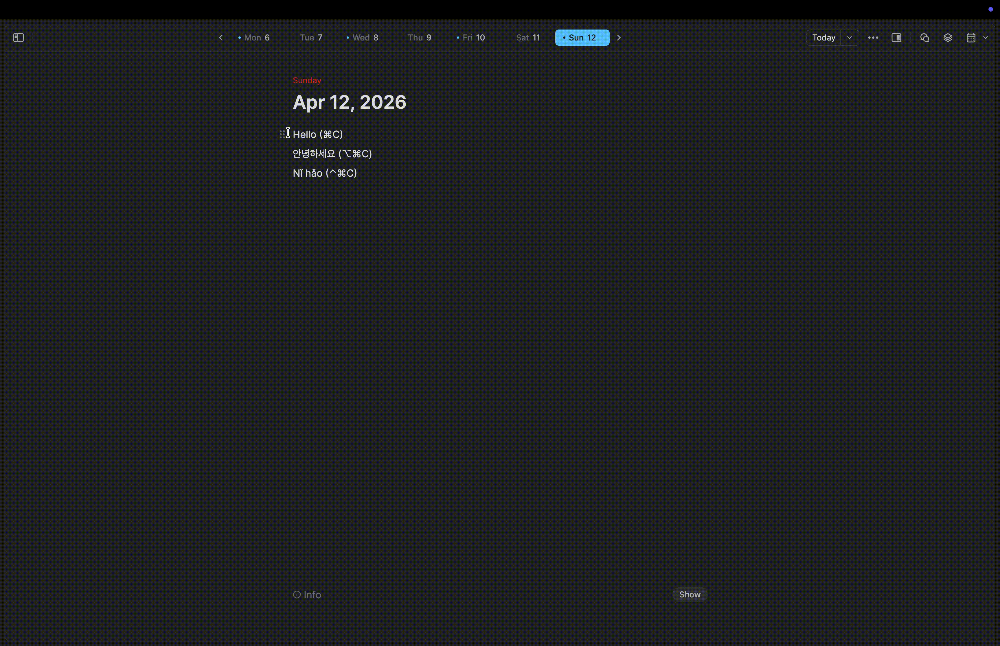
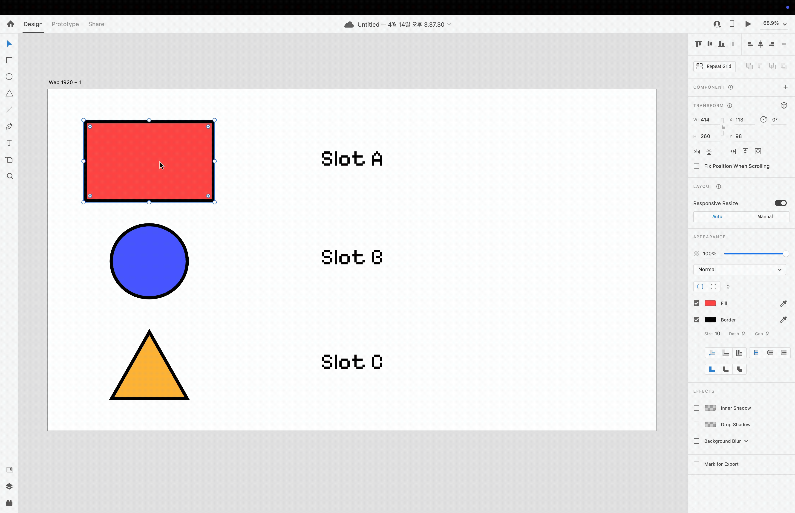

<p align="center">
  
</p>

<h1 align="center">DualClip</h1>

<p align="center">
  <a href="README.md">English</a> · <a href="README-ko.md">한국어</a> · <a href="README-ja.md">日本語</a> · <b>中文</b>
</p>

<p align="center">
  一款轻量级 macOS 菜单栏应用,提供<b>多槽位剪贴板管理</b>。<br>
  与基于历史记录的剪贴板管理器不同,DualClip 通过可自定义的键盘快捷键,让你即时访问专用剪贴板槽位。
</p>

<p align="center">
  <a href="https://rakkunn.github.io/DualClip/"><b>🌐 网站</b></a>
  &nbsp;·&nbsp;
  <a href="https://github.com/RAKKUNN/DualClip/releases/latest"><b>⬇ 下载</b></a>
  &nbsp;·&nbsp;
  <a href="#安装"><b>🍺 Homebrew</b></a>
</p>


## 功能特性

- **3 个剪贴板槽位**:Slot A (系统默认)、Slot B、Slot C
- **可自定义快捷键**:无硬编码键位冲突 — 自由配置你自己的快捷键
- **原子粘贴 (Atomic Paste)**:从任意槽位无缝粘贴,不会污染你的系统剪贴板
- **菜单栏弹出窗口**:一目了然地查看所有槽位内容,带预览
- **隐私优先**:所有数据仅存于内存 — 不写入磁盘
- **零网络访问**:无遥测、无分析、无任何互联网通信

## 演示

<p align="center">
  
</p>

<p align="center">
  
</p>

## 默认快捷键

| 操作 | 快捷键 |
|------|--------|
| 复制到 Slot B | ⌥⌘C |
| 从 Slot B 粘贴 | ⌥⌘V |
| 复制到 Slot C | ⌃⌘C |
| 从 Slot C 粘贴 | ⌃⌘V |

所有快捷键均可在 **Settings > Shortcuts** 中完全自定义。

## 工作原理

1. **Slot A** 自动镜像系统剪贴板 (⌘C / ⌘V)
2. **Slot B/C** 通过各自的复制快捷键独立存储内容
3. **原子粘贴**会临时交换系统剪贴板、模拟 ⌘V,然后恢复原始剪贴板 — 整个过程在约 150ms 内完成

## 系统要求

- macOS 13.0 (Ventura) 或更高版本
- Intel 或 Apple Silicon Mac — 预构建版本为通用二进制文件(`arm64` + `x86_64`)
- 辅助功能权限 (用于按键模拟)

## 安装

### Homebrew (推荐)

```bash
brew install RAKKUNN/tap/dualclip
```

### 手动下载

1. 前往[最新版本](https://github.com/RAKKUNN/DualClip/releases/latest)
2. 下载 `DualClip-x.x.x-universal.zip`
3. 解压并将 `DualClip.app` 移到 `/Applications`
4. 出现提示时授予辅助功能权限

> **说明**:从 v1.1.0 起,本应用经过 Apple 签名与公证。启动时不会出现安全警告。

### 从源码构建

```bash
# 克隆仓库
git clone https://github.com/RAKKUNN/DualClip.git
cd DualClip

# 在 Xcode 中打开
open Package.swift

# 或从命令行构建
swift build -c release
```

> **说明**:从源码构建需要 Xcode 或 Swift 5.9+ 命令行工具。

## 依赖

- [KeyboardShortcuts](https://github.com/sindresorhus/KeyboardShortcuts) — 全局键盘快捷键管理 (MIT)

## 架构

```
DualClip/
├── App/                    # 应用入口与代理
├── Models/                 # 数据模型 (SlotIdentifier, ClipboardSlot)
├── Services/               # 核心逻辑
│   ├── ClipboardManager    # NSPasteboard 轮询 (0.5 秒间隔)
│   ├── AtomicPasteService  # 剪贴板交换 + CGEvent ⌘V 模拟
│   └── AccessibilityService # 权限管理
├── Views/                  # SwiftUI 视图 (MenuBar, Settings, Onboarding)
└── Shortcuts/              # KeyboardShortcuts 集成
```

## 安全与隐私

- **不持久化**:剪贴板数据仅存在于内存中
- **不联网**:零外部通信 — 源代码可验证
- **开源**:对安全敏感的剪贴板访问保持完全透明
- **仅辅助功能权限**:最小化权限占用

## 路线图

- [x] 安全输入框检测 (在密码框中自动禁用)
- [x] 应用退出时 RAM 清零
- [x] 图像 / 富文本剪贴板支持
- [x] GitHub Actions CI/CD + 公证
- [x] Homebrew Cask 分发
- [ ] Sparkle 自动更新框架
- [ ] VoiceOver 无障碍支持

## 赞助

如果 DualClip 对您有用，请考虑赞助开发：

<a href="https://github.com/sponsors/RAKKUNN">
  
</a>

## 贡献

欢迎贡献!请先开 issue 讨论你想要做的更改。

## 许可证

[MIT](LICENSE)
