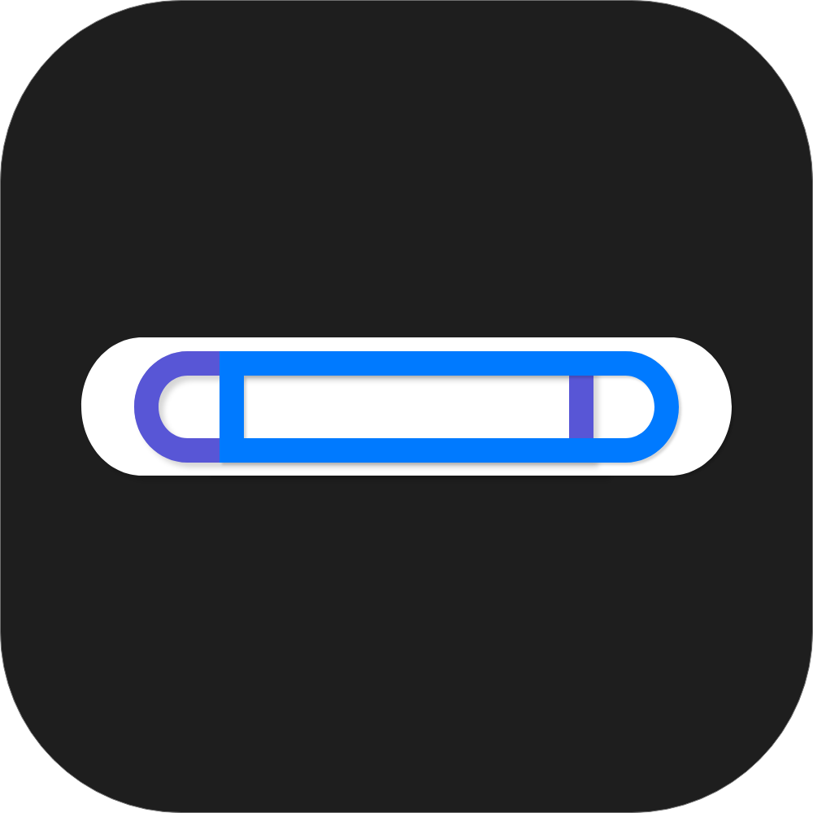

<p align="center">
  
</p>

<h1 align="center">DualClip</h1>

<p align="center">
  A lightweight macOS menu bar app that provides <b>multi-slot clipboard management</b>.<br>
  Unlike history-based clipboard managers, DualClip gives you instant access to dedicated clipboard slots via customizable keyboard shortcuts.
</p>


## Features

- **3 Clipboard Slots**: Slot A (system default), Slot B, and Slot C
- **Customizable Shortcuts**: No hardcoded key conflicts — configure your own shortcuts
- **Atomic Paste**: Seamlessly pastes from any slot without corrupting your system clipboard
- **Menu Bar Popover**: Quick-glance view of all slot contents with previews
- **Privacy First**: All data lives in RAM only — nothing is persisted to disk
- **Zero Network Access**: No telemetry, no analytics, no internet communication

## Default Shortcuts

| Action | Shortcut |
|--------|----------|
| Copy to Slot B | ⌥⌘C |
| Paste from Slot B | ⌥⌘V |
| Copy to Slot C | ⌃⌘C |
| Paste from Slot C | ⌃⌘V |

All shortcuts are fully customizable in **Settings > Shortcuts**.

## How It Works

1. **Slot A** automatically mirrors the system clipboard (⌘C / ⌘V)
2. **Slot B/C** store content independently via their own copy shortcuts
3. **Atomic Paste** temporarily swaps the system clipboard, simulates ⌘V, then restores the original clipboard — all within ~150ms

## Requirements

- macOS 13.0 (Ventura) or later
- Accessibility permission (required for keystroke simulation)

## Installation

### Download (Recommended)

1. Go to the [latest release](https://github.com/RAKKUNN/DualClip/releases/latest)
2. Download `DualClip-x.x.x-arm64.zip`
3. Unzip and move `DualClip.app` to `/Applications`
4. On first launch: **System Settings → Privacy & Security → "Open Anyway"**
5. Grant Accessibility permission when prompted

> **Note**: This app is not notarized. macOS will show a security warning on first launch — this is expected for open-source apps without an Apple Developer certificate.

### Building from Source

```bash
# Clone the repository
git clone https://github.com/RAKKUNN/DualClip.git
cd DualClip

# Open in Xcode
open Package.swift

# Or build from command line
swift build -c release
```

> **Note**: Building from source requires Xcode or Swift 5.9+ Command Line Tools.

## Dependencies

- [KeyboardShortcuts](https://github.com/sindresorhus/KeyboardShortcuts) — Global keyboard shortcut management (MIT)

## Architecture

```
DualClip/
├── App/                    # App entry point and delegate
├── Models/                 # Data models (SlotIdentifier, ClipboardSlot)
├── Services/               # Core logic
│   ├── ClipboardManager    # NSPasteboard polling (0.5s interval)
│   ├── AtomicPasteService  # Clipboard swap + CGEvent ⌘V simulation
│   └── AccessibilityService # Permission management
├── Views/                  # SwiftUI views (MenuBar, Settings, Onboarding)
└── Shortcuts/              # KeyboardShortcuts integration
```

## Security & Privacy

- **No Persistence**: Clipboard data exists only in memory
- **No Network**: Zero external communication — verified by source code
- **Open Source**: Full transparency for security-sensitive clipboard access
- **Accessibility Only**: Minimal permission footprint

## Roadmap

- [x] Secure input field detection (auto-disable in password fields)
- [x] RAM zeroing on app termination
- [x] Image/rich text clipboard support
- [ ] GitHub Actions CI/CD + Notarization
- [ ] Homebrew Cask distribution
- [ ] Sparkle auto-update framework
- [ ] VoiceOver accessibility support

## Contributing

Contributions are welcome! Please open an issue first to discuss what you'd like to change.

## License

[MIT](LICENSE)
